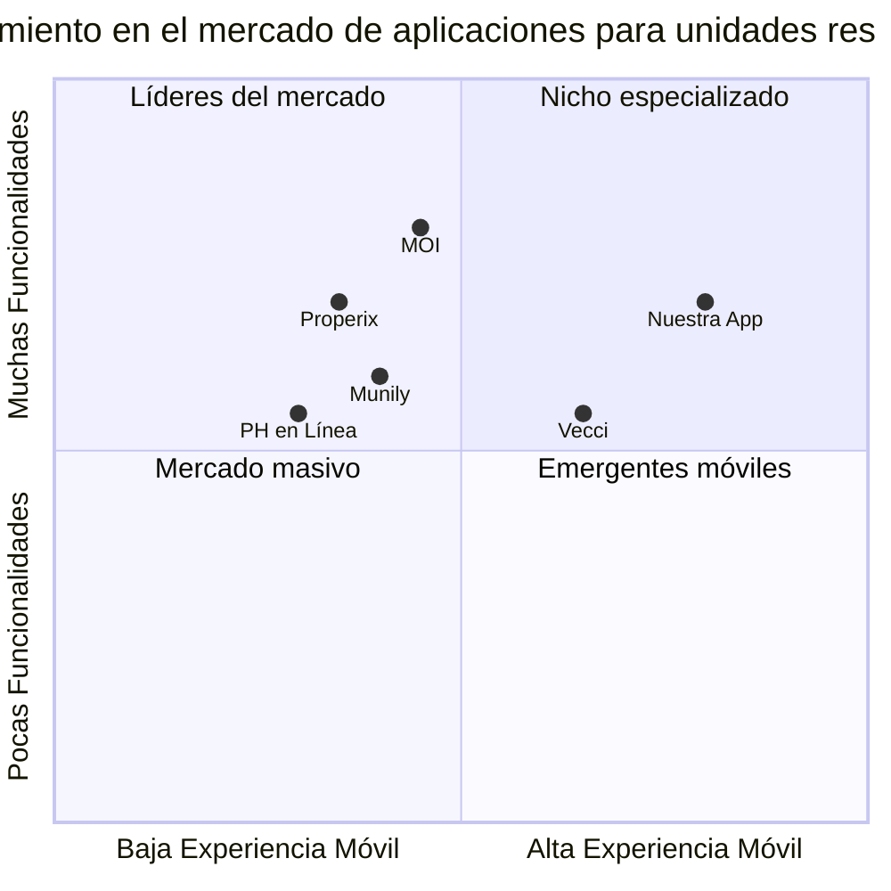

# Documento de Requisitos del Producto (PRD)
# Aplicación para Unidades Residenciales en Colombia

## Información del Proyecto

**Nombre del Proyecto:** residential_management_app  
**Fecha de Creación:** 03/08/2025  
**Autor:** Emma, Product Manager  
**Versión:** 1.0

## Requerimiento Original

Desarrollar una aplicación para unidades residenciales en Colombia que facilite la comunicación y gestión diaria entre residentes, copropietarios, porteros y administradores. La app debe incluir funciones como:

- Gestión de cuentas de cobro y notificaciones de pagos pendientes
- Citofonía virtual (comunicación entre portería y residentes)
- Medios de recaudo integrados (transferencia, PSE, QR, etc.)
- Aplicación móvil exclusiva para residentes (iOS y Android)

## 1. Definición del Producto

### 1.1 Objetivos del Producto

1. **Digitalizar la administración de unidades residenciales** para eliminar procesos manuales y reducir carga operativa en administradores.
2. **Mejorar la comunicación entre todos los actores** del conjunto residencial (residentes, porteros, administradores) para aumentar la satisfacción y sentido de comunidad.
3. **Optimizar los procesos de recaudo y pagos** para mejorar los flujos de caja y reducir la cartera morosa en las unidades residenciales.

### 1.2 Historias de Usuario

#### Como Residente:
1. Quiero recibir notificaciones de mis pagos pendientes, para poder planificar mis finanzas y evitar intereses de mora.
2. Quiero poder comunicarme con la portería de manera virtual, para autorizar visitantes incluso cuando no estoy en casa.
3. Quiero poder pagar mis cuotas de administración directamente desde la app, para evitar desplazamientos y ahorrar tiempo.
4. Quiero estar informado de los comunicados y decisiones importantes de la administración, para sentirme parte de la comunidad.
5. Quiero poder reservar zonas comunes desde mi celular, para organizar mis eventos sin complicaciones.

#### Como Administrador:
1. Quiero gestionar cuentas de cobro digitalmente, para reducir costos de papelería y tiempo administrativo.
2. Quiero enviar notificaciones masivas a los residentes, para mantenerlos informados de manera eficiente.
3. Quiero ver informes de recaudo en tiempo real, para tomar decisiones financieras oportunas.
4. Quiero gestionar solicitudes y quejas de forma ordenada, para mejorar la respuesta a las necesidades de los residentes.

#### Como Portero:
1. Quiero poder verificar fácilmente qué visitantes están autorizados, para aumentar la seguridad del conjunto.
2. Quiero comunicarme eficientemente con los residentes, para resolver dudas sobre correspondencia o visitantes.
3. Quiero registrar paquetería y correspondencia con evidencia fotográfica, para evitar confusiones o pérdidas.

### 1.3 Análisis Competitivo

| Competidor | Descripción | Fortalezas | Debilidades |
|------------|-------------|------------|-------------|
| **Vecci** | Aplicación para unidades residenciales con enfoque en comunicación entre residentes, copropietarios, porteros y administradores | - Pagos virtuales - Citofonía virtual - Gestión de correspondencia con evidencia fotográfica - Comunicación efectiva con resúmenes AI | - Sin integración con sistemas de seguridad física - Sin funcionalidad de reserva de zonas comunes |
| **MOI** | Plataforma integral para gestión de copropiedades | - Facturación rápida (ahorro del 90% del tiempo) - Pagos automatizados - Control de vehículos con cámaras - Software para asambleas | - Curva de aprendizaje compleja - Posiblemente sobrecargada de funciones para comunidades pequeñas |
| **Munily** | Software impulsado por IA para digitalizar seguridad, contabilidad y comunicación | - Impulsado por IA - Integración de contabilidad - Enfoque en seguridad | - Posible costo elevado - Puede no estar tan enfocado en la experiencia móvil |
| **PH en Línea** | Herramienta web para optimizar procesos administrativos y contables | - Enfoque en procesos administrativos - Herramientas contables - Experiencia en mercado colombiano | - Posible interfaz menos moderna - Experiencia móvil limitada |
| **Properix** | Software especializado en administración de propiedad horizontal | - Integración de múltiples herramientas - Enfoque en gestión comunitaria | - Puede carecer de innovaciones como IA - Menos enfoque en la experiencia móvil |
| **Aplicación propuesta** | Solución integral con enfoque en experiencia móvil y comunicación | - Experiencia móvil optimizada - Citofonía virtual innovadora - Múltiples medios de recaudo integrados - Enfoque en UX personalizada por tipo de usuario - Integraciones IoT | - Nueva en el mercado - En desarrollo |

### 1.4 Cuadrante Competitivo

## 2. Especificaciones Técnicas

### 2.1 Análisis de Requerimientos

La aplicación debe satisfacer las necesidades de cuatro tipos principales de usuarios: residentes, copropietarios, porteros y administradores, facilitando la comunicación y gestión diaria de la unidad residencial. Los requerimientos se han dividido en categorías funcionales clave:

1. **Sistema de gestión de pagos y cobros**:
   - Generación automática de cuentas de cobro
   - Notificaciones de pagos pendientes
   - Reportes de cartera y recaudo
   - Integración con múltiples pasarelas de pago

2. **Sistema de comunicación virtual**:
   - Citofonía virtual entre portería y residentes
   - Mensajería directa entre administración y residentes
   - Sistema de anuncios y comunicados

3. **Sistema de control de acceso**:
   - Registro de visitantes
   - Autorización digital de acceso
   - Registro de entrada y salida de vehículos
   - Escaneo de documentos de identidad

4. **Gestión de zonas comunes**:
   - Reserva de espacios compartidos
   - Pago de servicios adicionales
   - Control de aforo y horarios

5. **Sistema de paquetería y correspondencia**:
   - Registro fotográfico de paquetes
   - Notificación de llegada
   - Confirmación de entrega

### 2.2 Pool de Requerimientos

#### Requerimientos P0 (Esenciales)

1. **Autenticación y Gestión de Usuarios**
   - Sistema de registro e inicio de sesión para diferentes tipos de usuarios
   - Verificación de identidad para residentes y copropietarios
   - Perfil de usuario con información personal y de contacto

2. **Gestión de Pagos**
   - Generación y envío digital de cuentas de cobro
   - Notificaciones push de pagos pendientes
   - Integración con PSE para pagos directos
   - Dashboard de estado de cuenta para residentes

3. **Citofonía Virtual**
   - Comunicación bidireccional entre portería y residentes
   - Registro de llamadas y notificaciones
   - Autorización remota de visitantes

4. **Panel Administrativo**
   - Dashboard con indicadores clave para administradores
   - Herramientas de gestión de cartera
   - Sistema para envío masivo de comunicados

#### Requerimientos P1 (Importantes)

5. **Medios de Recaudo Adicionales**
   - Pago mediante códigos QR
   - Integración con billeteras digitales (Nequi, Daviplata)
   - Recaudos en efectivo con registro en app

6. **Comunicación Comunitaria**
   - Foro de discusión para temas comunitarios
   - Sistema de votaciones para decisiones colectivas
   - Directorio de residentes (opt-in)

7. **Gestión de Zonas Comunes**
   - Calendario de disponibilidad
   - Sistema de reserva
   - Pago de tarifas especiales

8. **Gestión de Paquetería y Correspondencia**
   - Registro fotográfico de paquetes recibidos
   - Notificaciones de llegada de correspondencia
   - Historial de entregas

#### Requerimientos P2 (Deseables)

9. **Integración IoT**
   - Conexión con sistemas de intercomunicación existentes
   - Integración con cerraduras inteligentes
   - Monitoreo de consumo de servicios públicos

10. **Funcionalidades Avanzadas**
    - Asistente virtual para consultas frecuentes
    - Módulo para asambleas virtuales
    - Encuestas de satisfacción automáticas

11. **Analytics**
    - Informes de uso de áreas comunes
    - Estadísticas de comunicación y tiempos de respuesta
    - Análisis predictivo de morosidad

### 2.3 Diseño UI Preliminar

A continuación se presenta una descripción general de las pantallas clave de la aplicación:

#### Para Residentes:

1. **Pantalla de Inicio (Dashboard)**
   - Resumen de pagos pendientes
   - Acceso rápido a citofonía virtual
   - Notificaciones recientes
   - Accesos directos a funciones principales

2. **Pantalla de Pagos**
   - Estado de cuenta actual
   - Historial de pagos
   - Opciones de pago
   - Detalle de conceptos facturados

3. **Citofonía Virtual**
   - Lista de llamadas recientes
   - Botón de llamada a portería
   - Historial de visitantes autorizados
   - Autorización rápida

4. **Zonas Comunes**
   - Calendario de disponibilidad
   - Formulario de reserva
   - Historial de reservas
   - Pago de tarifas adicionales

5. **Notificaciones y Comunicados**
   - Lista de comunicados oficiales
   - Notificaciones personalizadas
   - Acceso a documentos importantes

#### Para Administradores:

1. **Dashboard Administrativo**
   - Indicadores de recaudo
   - Alertas de pagos pendientes
   - Actividad reciente en la comunidad
   - Tareas pendientes

2. **Gestión de Cobros**
   - Generación de cuentas de cobro
   - Seguimiento de pagos
   - Reportes financieros
   - Notificaciones automáticas

3. **Comunicaciones**
   - Envío de comunicados
   - Programación de notificaciones
   - Estadísticas de lectura
   - Plantillas personalizables

4. **Gestión Comunitaria**
   - Directorio de residentes
   - Gestión de quejas y solicitudes
   - Encuestas y votaciones

#### Para Porteros:

1. **Panel de Control**
   - Lista de residentes
   - Registro de visitantes
   - Acceso a citofonía virtual
   - Notificaciones de administración

2. **Registro de Paquetería**
   - Formulario de registro
   - Captura de fotos
   - Notificaciones a residentes
   - Historial de entregas

3. **Control de Acceso**
   - Verificación de visitantes autorizados
   - Registro de entrada y salida
   - Escaneo de documentos
   - Comunicación con residentes

### 2.4 Preguntas Abiertas

1. **Integración con sistemas existentes**: ¿Hay sistemas de citofonía o seguridad ya implementados en las unidades residenciales objetivo que deban integrarse con la aplicación?

2. **Escalabilidad**: ¿Se espera que la aplicación sirva tanto a pequeñas unidades residenciales (20-50 apartamentos) como a grandes conjuntos (500+ apartamentos)?

3. **Modalidades de pago**: ¿Qué porcentaje de residentes prefiere pagos digitales vs. pagos tradicionales? ¿Se requiere un sistema híbrido?

4. **Seguridad de datos**: ¿Qué nivel de seguridad se requiere para la información personal y financiera? ¿Se necesitan certificaciones específicas?

5. **Conectividad**: ¿Todas las zonas de las unidades residenciales cuentan con buena cobertura WiFi/4G? ¿Se requiere funcionamiento offline?

## 3. Propuesta de Valor Diferencial

### 3.1 Funcionalidades Innovadoras

Basados en el análisis del mercado y las tendencias globales, proponemos las siguientes funcionalidades diferenciadoras:

1. **Sistema de Citofonía Virtual Avanzado**
   - Llamadas de video en HD
   - Opción de mensajes pregrabados para visitantes frecuentes
   - Integración con cerraduras inteligentes para autorización remota
   - Historial visual de visitantes con reconocimiento facial (opt-in)

2. **Asistente Virtual Comunitario**
   - Chatbot especializado en responder consultas sobre la unidad residencial
   - Automatización de solicitudes frecuentes
   - Recomendaciones personalizadas basadas en comportamiento previo
   - Resúmenes de comunicados con IA

3. **Ecosistema de Pagos Completo**
   - Integración con todas las pasarelas de pago relevantes en Colombia
   - Sistema de incentivos por pronto pago
   - Opciones de financiación para cuotas extraordinarias
   - Histórico visual de gastos de administración

4. **Gestión Comunitaria Inteligente**
   - Sistema de votaciones digitales para decisiones comunitarias
   - Encuestas en tiempo real para mejorar servicios
   - Marketplace comunitario para servicios entre vecinos
   - Tablón de anuncios digital con clasificados

5. **Integración IoT para "Smart Building"**
   - Monitoreo de consumo energético y agua en áreas comunes
   - Control de acceso mediante reconocimiento biométrico
   - Sensores de ocupación en zonas comunes
   - Alertas de mantenimiento predictivo

### 3.2 Enfoque en Experiencia de Usuario

Nuestra propuesta pone especial énfasis en la experiencia de usuario personalizada según el rol:

1. **Para Residentes**: Interfaz limpia y minimalista centrada en las acciones más frecuentes (pagar, comunicarse con portería, reservar zonas comunes).

2. **Para Administradores**: Dashboard analítico potente con herramientas de gestión financiera y comunitaria que simplifican las tareas administrativas.

3. **Para Porteros**: Interfaz optimizada para uso táctil rápido, con accesos directos a las funciones más utilizadas en portería.

4. **Para Copropietarios no residentes**: Módulo especializado con énfasis en información financiera, ocupación y estado de la propiedad.

## 4. Estrategia de Implementación

Se recomienda un desarrollo por fases para permitir validación temprana con usuarios reales:

### Fase 1: MVP (3 meses)
- Autenticación y perfiles de usuario
- Citofonía virtual básica
- Sistema de pagos con PSE
- Comunicados y notificaciones
- Dashboard administrativo básico

### Fase 2: Expansión (3 meses adicionales)
- Integración de métodos de pago adicionales
- Gestión de zonas comunes
- Sistema de correspondencia y paquetería
- Analytics básicos

### Fase 3: Funcionalidades Avanzadas (4 meses adicionales)
- Asistente virtual
- Integraciones IoT
- Marketplace comunitario
- Sistema avanzado de votaciones y asambleas virtuales

## 5. Métricas de Éxito

1. **Adopción**: Porcentaje de residentes que utilizan activamente la aplicación (meta: 80%)

2. **Recaudo**: Reducción en cartera vencida y mejora en tiempos de pago (meta: reducción del 30% en cartera vencida)

3. **Satisfacción**: NPS de residentes, administradores y porteros (meta: NPS > 50)

4. **Eficiencia**: Reducción en tiempo administrativo dedicado a tareas manuales (meta: reducción del 60%)

5. **Comunicación**: Tasa de apertura de comunicados y tiempo de respuesta a solicitudes (meta: >80% de tasa de apertura, <24h tiempo de respuesta)

---

Este PRD será la base para el desarrollo de prototipos de alta fidelidad y la implementación técnica del producto. Se recomienda validar los requerimientos con stakeholders clave y realizar pruebas de usabilidad en cada fase del desarrollo.