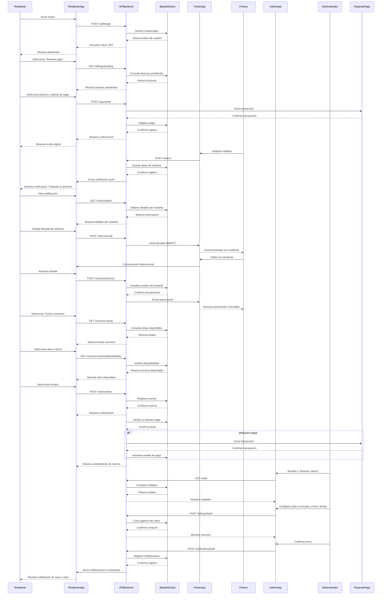
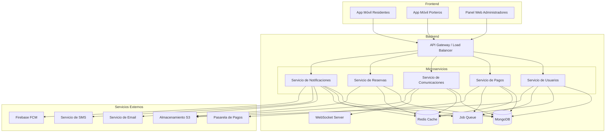

# Diseño del Sistema - Aplicación de Gestión para Unidades Residenciales

## Implementación y Enfoque Técnico

Después de analizar detalladamente los requisitos del producto para la aplicación de unidades residenciales en Colombia, he diseñado una arquitectura que equilibra funcionalidad, experiencia de usuario y viabilidad técnica. A continuación, presento las decisiones estratégicas y técnicas para la implementación de este sistema.

### Análisis de Puntos Críticos

1. **Arquitectura Multiplataforma**: La necesidad de cubrir iOS y Android manteniendo una experiencia nativa.
2. **Comunicación en Tiempo Real**: El sistema de citofonía virtual requiere comunicación instantánea.
3. **Procesamiento de Pagos**: Necesidad de integración segura con múltiples proveedores de pago.
4. **Escalabilidad**: El sistema debe funcionar tanto para pequeñas como grandes unidades residenciales.
5. **Personalización**: Múltiples perfiles de usuario con necesidades específicas.

### Marco Tecnológico Propuesto

#### Frontend
- **Framework Principal**: React Native
  - Justificación: Permite desarrollo multiplataforma con experiencia nativa, acelerando el desarrollo y mantenimiento.
  - Complementos: React Navigation para la navegación entre pantallas.

- **Bibliotecas UI**:
  - React Native Paper: Para componentes UI con Material Design adaptable.
  - React Native Elements: Para componentes adicionales y personalizables.

- **Estado de la Aplicación**:
  - Redux/Redux Toolkit: Para la gestión global del estado.
  - React Query: Para la gestión eficiente de datos remotos y caché.

#### Backend
- **Plataforma Principal**: Node.js con Express.js
  - Justificación: Excelente para APIs RESTful y soporte de WebSockets.

- **Comunicación en Tiempo Real**:
  - Socket.IO: Para la funcionalidad de citofonía virtual y notificaciones en tiempo real.

- **Base de Datos**:
  - MongoDB: Base de datos principal para información de usuarios, propiedades, etc.
  - Redis: Para cacheo y gestión de sesiones.

- **Autenticación**:
  - JWT (JSON Web Tokens): Para autenticación segura.
  - OAuth 2.0: Para integración con proveedores de identidad.

#### Procesamiento de Pagos
- **Agregador de Pagos**: Wompi o PayU Colombia
  - Justificación: Amplia cobertura de métodos de pago en Colombia, incluyendo PSE, tarjetas y métodos alternativos.
  - API Directa: Integración directa con APIs de bancos para casos especiales.

#### Comunicación y Notificaciones
- **Notificaciones Push**: Firebase Cloud Messaging
- **SMS/Email**: Twilio para SMS, SendGrid para emails
- **Video/Audio**: WebRTC para la citofonía virtual con video

#### Seguridad
- **Encriptación**: SSL/TLS para comunicaciones, algoritmos AES-256 para datos sensibles
- **Validación**: Sanitización de inputs, validación del lado del servidor
- **Prevención de ataques**: Protección contra CSRF, XSS, inyecciones SQL

#### Almacenamiento
- **Media Storage**: Amazon S3 o Google Cloud Storage para fotos y documentos
- **CDN**: Cloudflare para servir activos estáticos

### Arquitectura del Sistema

La arquitectura propuesta sigue un modelo cliente-servidor con microservicios para los componentes críticos:

```
[Aplicación Móvil React Native]
        |
        v
[API Gateway / Load Balancer]
        |
        +----------------------+----------------------+
        |                      |                      |
        v                      v                      v
[Servicio de Usuarios]  [Servicio de Pagos]   [Servicio de Comunicación]
        |                      |                      |
        v                      v                      v
[Base de Datos]         [Pasarelas de Pago]    [WebSockets/WebRTC]
```

## Estructuras de Datos e Interfaces

```mermaid
classDiagram
    class User {
        <<abstract>>
        +id: String
        +name: String
        +email: String
        +phone: String
        +profilePic: String
        +createdAt: Date
        +updatedAt: Date
        +authenticate(password: String): Boolean
        +updateProfile(userData: Object): User
    }

    class Resident {
        +unitId: String
        +isOwner: Boolean
        +familyMembers: Array~User~
        +vehicles: Array~Vehicle~
        +paymentMethods: Array~PaymentMethod~
        +notificationPreferences: NotificationPreferences
        +getPendingPayments(): Array~Payment~
        +authorizeVisitor(visitor: Visitor): AuthorizationCode
        +makePayment(paymentInfo: Object): PaymentResult
        +reserveCommonArea(reservation: Object): Reservation
    }

    class Administrator {
        +properties: Array~Property~
        +generateBillings(): Array~Billing~
        +sendBroadcastNotification(message: Object): NotificationResult
        +getFinancialReports(): Array~Report~
        +manageComplaints(action: String, complaintId: String): ComplaintResult
        +scheduleMaintenances(maintenanceInfo: Object): MaintenanceSchedule
    }

    class Porter {
        +propertyId: String
        +shift: String
        +registerVisitor(visitorInfo: Object): Visitor
        +contactResident(residentId: String): CallResult
        +registerPackage(packageInfo: Object): Package
        +scanIdentification(documentImage: Image): IdentificationResult
    }

    class Property {
        +id: String
        +name: String
        +address: String
        +units: Array~Unit~
        +commonAreas: Array~CommonArea~
        +administrators: Array~Administrator~
        +porters: Array~Porter~
        +generatePropertyReport(): PropertyReport
        +getBuildingStatus(): StatusReport
    }

    class Unit {
        +id: String
        +propertyId: String
        +number: String
        +floor: Number
        +area: Number
        +residents: Array~Resident~
        +owner: Resident
        +billings: Array~Billing~
        +getPaymentHistory(): Array~Payment~
        +getResidentHistory(): Array~ResidentHistory~
    }

    class Billing {
        +id: String
        +unitId: String
        +amount: Number
        +dueDate: Date
        +status: String
        +concept: String
        +createdAt: Date
        +paymentDetails: Array~PaymentDetail~
        +generatePDF(): PDF
        +sendNotification(): NotificationResult
        +applyLateCharge(): Billing
    }

    class Payment {
        +id: String
        +billingId: String
        +residentId: String
        +amount: Number
        +paymentMethod: String
        +status: String
        +transactionId: String
        +timestamp: Date
        +receiptNumber: String
        +generateReceipt(): Receipt
        +refund(): RefundResult
    }

    class CommonArea {
        +id: String
        +propertyId: String
        +name: String
        +capacity: Number
        +availableTimeSlots: Array~TimeSlot~
        +reservations: Array~Reservation~
        +costPerHour: Number
        +rules: String
        +getAvailability(date: Date): Array~TimeSlot~
        +makeReservation(residentId: String, timeSlot: TimeSlot): Reservation
    }

    class Reservation {
        +id: String
        +commonAreaId: String
        +residentId: String
        +date: Date
        +startTime: Time
        +endTime: Time
        +status: String
        +cost: Number
        +paymentId: String
        +cancel(): RefundResult
        +extendTime(additionalTime: Number): ReservationResult
    }

    class Visitor {
        +id: String
        +name: String
        +identificationType: String
        +identificationNumber: String
        +photo: String
        +hostUnitId: String
        +arrivalTime: DateTime
        +departureTime: DateTime
        +purpose: String
        +status: String
        +vehicleInfo: Vehicle
        +scanDocument(documentImage: Image): IdentificationResult
        +notifyHost(): NotificationResult
    }

    class Package {
        +id: String
        +unitId: String
        +description: String
        +photos: Array~String~
        +deliveryCompany: String
        +receivedBy: String
        +receivedAt: DateTime
        +status: String
        +notifyResident(): NotificationResult
        +markAsDelivered(signature: Image): DeliveryResult
    }

    class Notification {
        +id: String
        +targetUsers: Array~String~
        +title: String
        +content: String
        +type: String
        +priority: String
        +createdAt: DateTime
        +read: Boolean
        +readAt: DateTime
        +actions: Array~Action~
        +send(): DeliveryStatus
        +markAsRead(): Notification
    }

    class Complaint {
        +id: String
        +residentId: String
        +title: String
        +description: String
        +category: String
        +status: String
        +priority: String
        +attachments: Array~String~
        +createdAt: DateTime
        +assigneeId: String
        +updateStatus(status: String, comments: String): Complaint
        +assignTo(userId: String): Complaint
    }

    class VirtualIntercom {
        +id: String
        +callerId: String
        +receiverId: String
        +startTime: DateTime
        +endTime: DateTime
        +status: String
        +recordingUrl: String
        +initiateCall(): CallStatus
        +endCall(): CallSummary
        +authorizeEntry(): AuthorizationResult
    }

    class PaymentMethod {
        +id: String
        +userId: String
        +type: String
        +providerToken: String
        +last4Digits: String
        +expiryDate: String
        +isDefault: Boolean
        +validate(): ValidationResult
        +makeDefault(): PaymentMethod
        +delete(): DeletionResult
    }

    class Vehicle {
        +id: String
        +ownerId: String
        +type: String
        +brand: String
        +model: String
        +color: String
        +plate: String
        +registerEntry(timestamp: DateTime): EntryRecord
        +registerExit(timestamp: DateTime): ExitRecord
    }

    class Report {
        +id: String
        +type: String
        +periodStart: Date
        +periodEnd: Date
        +data: Object
        +createdAt: DateTime
        +format: String
        +generatePDF(): PDF
        +sendByEmail(email: String): DeliveryStatus
    }

    class NotificationPreferences {
        +userId: String
        +pushEnabled: Boolean
        +emailEnabled: Boolean
        +smsEnabled: Boolean
        +paymentAlerts: Boolean
        +visitorAlerts: Boolean
        +packageAlerts: Boolean
        +communityAlerts: Boolean
        +updatePreferences(preferences: Object): NotificationPreferences
    }

    class MaintenanceSchedule {
        +id: String
        +propertyId: String
        +title: String
        +description: String
        +areas: Array~String~
        +startDate: DateTime
        +endDate: DateTime
        +status: String
        +assignedTo: Array~String~
        +notifyResidents(): NotificationResult
        +updateStatus(status: String): MaintenanceSchedule
    }

    User <|-- Resident
    User <|-- Administrator
    User <|-- Porter
    Property --o Unit
    Property --o CommonArea
    Unit --o Billing
    Unit --* Resident
    Billing --o Payment
    CommonArea --o Reservation
    Resident --o Vehicle
    Resident --o PaymentMethod
    Resident --o NotificationPreferences
    Notification --o User
    Visitor --o Unit
    Package --o Unit
    VirtualIntercom --o User
    Complaint --o Resident
    Complaint --o Administrator
    Property --o MaintenanceSchedule
    Report --o Administrator
```



## Flujo de Programa



## Diagrama de Arquitectura de la Aplicación



## Diseño de Experiencia de Usuario

### Principios de Diseño

1. **Simplicidad**: Interfaces limpias con enfoque en las tareas más frecuentes para cada perfil.
2. **Consistencia**: Elementos UI coherentes a través de toda la aplicación.
3. **Feedback claro**: Confirmaciones visuales y notificaciones claras de acciones realizadas.
4. **Personalización**: Experiencia adaptada a cada perfil de usuario.
5. **Accesibilidad**: Diseño inclusivo que considere diferentes capacidades.

### Guías de Estilo

#### Paleta de Colores
- **Principal**: #3F51B5 (Indigo)
- **Secundario**: #00BCD4 (Cyan)
- **Acento**: #FF4081 (Rosa)
- **Fondo**: #F5F5F5 (Gris claro)
- **Texto**: #212121 (Casi negro)
- **Estado de éxito**: #4CAF50 (Verde)
- **Estado de error**: #F44336 (Rojo)
- **Estado de advertencia**: #FF9800 (Naranja)

#### Tipografía
- **Principal**: Roboto
- **Secundaria**: Open Sans
- **Tamaños**:
  - Títulos: 20-24px
  - Subtítulos: 16-18px
  - Cuerpo: 14-16px
  - Pequeño: 12px

#### Iconografía
- **Sistema**: Material Design Icons
- **Estilo**: Outlined para navegación, Filled para acciones

### Flujos de Navegación por Perfil de Usuario

#### Residente

```
[Login] → [Dashboard]
 ├─→ [Pagos]
 │   ├─→ [Estado de Cuenta]
 │   ├─→ [Realizar Pago]
 │   └─→ [Historial de Pagos]
 │
 ├─→ [Citofonía Virtual]
 │   ├─→ [Llamada Activa]
 │   └─→ [Historial de Visitas]
 │
 ├─→ [Zonas Comunes]
 │   ├─→ [Ver Disponibilidad]
 │   ├─→ [Realizar Reserva]
 │   └─→ [Mis Reservas]
 │
 ├─→ [Comunicados]
 │   ├─→ [Leer Comunicado]
 │   └─→ [Historial de Comunicados]
 │
 ├─→ [Paquetería]
 │   ├─→ [Paquetes por Recoger]
 │   └─→ [Historial de Paquetes]
 │
 └─→ [Perfil]
     ├─→ [Editar Información]
     ├─→ [Preferencias de Notificaciones]
     └─→ [Métodos de Pago]
```

#### Portero

```
[Login] → [Panel Principal]
 ├─→ [Registro de Visitantes]
 │   ├─→ [Nuevo Visitante]
 │   ├─→ [Visitantes Activos]
 │   └─→ [Historial de Visitantes]
 │
 ├─→ [Citofonía]
 │   ├─→ [Llamar a Residente]
 │   └─→ [Historial de Llamadas]
 │
 ├─→ [Paquetería]
 │   ├─→ [Registrar Paquete]
 │   ├─→ [Entrega de Paquete]
 │   └─→ [Historial de Paquetería]
 │
 ├─→ [Incidencias]
 │   ├─→ [Registrar Incidencia]
 │   └─→ [Historial de Incidencias]
 │
 └─→ [Mi Perfil]
     └─→ [Cambiar Contraseña]
```

#### Administrador

```
[Login] → [Dashboard Administrativo]
 ├─→ [Gestión Financiera]
 │   ├─→ [Generar Cobros]
 │   ├─→ [Estado de Cartera]
 │   ├─→ [Informes Financieros]
 │   └─→ [Configurar Conceptos]
 │
 ├─→ [Comunicación]
 │   ├─→ [Enviar Comunicado]
 │   ├─→ [Programar Notificación]
 │   └─→ [Historial de Comunicados]
 │
 ├─→ [Gestión de Usuarios]
 │   ├─→ [Residentes]
 │   ├─→ [Porteros]
 │   └─→ [Administradores]
 │
 ├─→ [Zonas Comunes]
 │   ├─→ [Configurar Áreas]
 │   ├─→ [Ver Reservas]
 │   └─→ [Informes de Uso]
 │
 ├─→ [Mantenimiento]
 │   ├─→ [Programar Mantenimiento]
 │   └─→ [Historial de Mantenimientos]
 │
 ├─→ [Quejas y Reclamos]
 │   ├─→ [Quejas Pendientes]
 │   └─→ [Historial de Soluciones]
 │
 └─→ [Configuración]
     ├─→ [Perfil de Propiedad]
     ├─→ [Notificaciones Automáticas]
     └─→ [Copias de Seguridad]
```

## Pantallas Principales (Mockups Descriptivos)

### Aplicación de Residentes

#### 1. Dashboard de Residente
- **Contenido**: Resumen visual de pagos pendientes, acceso rápido a citofonía virtual, y notificaciones recientes.
- **Elementos UI**:
  - Tarjeta de pagos pendientes con monto total y fecha límite más próxima
  - Botón prominente para citofonía virtual
  - Lista de las últimas 3 notificaciones
  - Accesos directos a reservas, paquetería y comunicados
  - Barra de navegación inferior con iconos para: Inicio, Pagos, Citofonía, Zonas Comunes, Perfil

#### 2. Pantalla de Pagos
- **Contenido**: Estado actual de cuenta, facturas pendientes y opciones de pago.
- **Elementos UI**:
  - Pestañas para "Pendiente", "Historial" y "Métodos de Pago"
  - Lista de facturas con concepto, fecha límite y monto
  - Opción de pago rápido con métodos guardados
  - Botón para agregar nuevo método de pago
  - Vista detallada de conceptos facturados

#### 3. Citofonía Virtual
- **Contenido**: Interfaz para atender llamadas de portería y autorizar visitantes.
- **Elementos UI**:
  - Pantalla de llamada entrante con foto/video del visitante
  - Botones grandes para "Contestar", "Rechazar" y "Autorizar entrada"
  - Historial de visitantes recientes con foto y hora
  - Opción para mensajes predefinidos a portería

### Aplicación de Porteros

#### 1. Panel Principal de Portero
- **Contenido**: Vista rápida de residentes, registro de visitantes y paquetería.
- **Elementos UI**:
  - Directorio de residentes con búsqueda rápida
  - Botón prominente para "Registrar visitante"
  - Sección para visitantes actuales en la propiedad
  - Alertas de paquetes pendientes por entregar
  - Barra de navegación inferior con: Inicio, Visitantes, Citofonía, Paquetería, Más

#### 2. Registro de Visitantes
- **Contenido**: Formulario para registrar nuevos visitantes.
- **Elementos UI**:
  - Campos para información del visitante (nombre, ID, foto)
  - Selector de unidad a visitar
  - Captura de foto del visitante
  - Escaneo de documento de identidad
  - Botón para iniciar llamada a residente

### Aplicación de Administradores

#### 1. Dashboard Administrativo
- **Contenido**: Indicadores clave de gestión y accesos rápidos.
- **Elementos UI**:
  - Gráficos de recaudo mensual y cartera vencida
  - Indicadores de ocupación de la propiedad
  - Alertas de mantenimientos programados
  - Tabla de últimas transacciones
  - Menú lateral con acceso a todas las secciones

#### 2. Gestión de Cobros
- **Contenido**: Herramientas para generación y seguimiento de cobros.
- **Elementos UI**:
  - Selector de unidades (individual o masivo)
  - Formulario para creación de conceptos de cobro
  - Calendario para programación de fechas límite
  - Vista previa de notificación a residentes
  - Botones para "Guardar borrador" y "Enviar cobros"

## Puntos de Clarificación

1. **Integración con sistemas existentes**:
   - Se necesita clarificar qué sistemas de citofonía o control de acceso están actualmente en uso en las unidades residenciales objetivo.
   - La arquitectura permite integración con sistemas existentes mediante API adaptadoras.

2. **Nivel de personalización por unidad residencial**:
   - La arquitectura permite configurar diferentes módulos según las necesidades de cada unidad residencial.
   - Se recomienda implementar un panel de administración de características por propiedad.

3. **Requisitos de funcionamiento offline**:
   - La aplicación implementará sincronización offline para funcionalidades críticas como consulta de comunicados y autorización de visitantes.
   - Es necesario confirmar el nivel de conectividad típico en las áreas comunes de las propiedades objetivo.

4. **Certificaciones de seguridad requeridas**:
   - El sistema está diseñado para cumplir con estándares PCI DSS para el manejo de información financiera.
   - Se recomienda aclarar si se requieren certificaciones adicionales específicas del mercado colombiano.

## Implementación Recomendada

Se recomienda seguir el enfoque de MVP (Producto Mínimo Viable) propuesto en el PRD, comenzando con las funcionalidades esenciales:

1. **Fase 1 (MVP - 3 meses)**:
   - Sistema de autenticación y perfiles
   - Citofonía virtual básica
   - Sistema de pagos con PSE
   - Comunicados y notificaciones
   - Dashboard administrativo básico

Una vez validadas estas funcionalidades con usuarios reales, proceder con las fases de expansión y funcionalidades avanzadas definidas en el PRD.